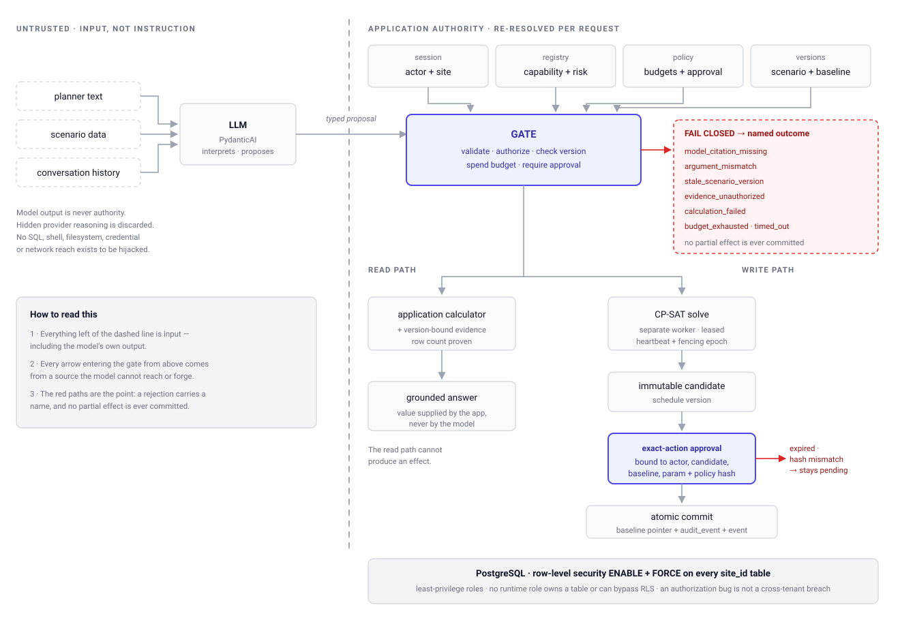

# ShiftMind

**An AI-assisted workflow for reviewing, repairing, and approving workforce schedules.**

ShiftMind lets a planner describe a change in plain English, review a schedule produced by OR-Tools CP-SAT, approve it, and promote it as the new baseline. The language model suggests actions; application code validates and controls every change.

> **Status:** Local Docker Compose portfolio project, not a hosted or production-ready service. The default demo is deterministic and keyless. ShiftMind is the product name; the repository and package retain the earlier `rosterai` name.

## What you can do

- Inspect workers, demand, constraints, locks, and the baseline through conversation.
- Describe a change and review its typed proposal before optimization.
- Generate and compare a candidate without trading away the best coverage found.
- Approve one exact promotion action.
- Trace the decision from conversation to solver run, approval, audit, and baseline.

## Run locally

You need:

- Git and Docker Desktop, or Docker Engine with Compose v2.
- 8 GB of memory available to Docker.
- Free ports `5432` and `8080` (both are configurable).

From the repository root:

```bash
docker compose up -d --build
```

Then:

1. Open `http://localhost:8080`.
2. Sign in through the local fake identity provider.
3. Select either immutable fixture.
4. Start a conversation, inspect the scenario, and request a scheduling change.
5. Review the candidate, request approval, and open its provenance timeline.

The composed stack uses a keyless deterministic agent by default. Check readiness or inspect startup failures with:

```bash
docker compose ps
docker compose logs bootstrap api worker web
```

See [Getting Started](docs/GETTING-STARTED.md) for configuration and recovery. The [walkthrough](docs/WALKTHROUGH.md) records an end-to-end journey.

## Why the design is governed

The difficult part is not connecting chat to an optimizer. It is keeping a probabilistic model useful without allowing it to become a source of record.

- **Invented or stale numbers:** an application calculator produces each number; a grounding gate checks its arguments, version, authorization, and evidence.
- **Stale approvals:** approval binds the actor, action, parameters, versions, consequence, policy, and expiry.
- **Lost worker leases:** a fencing epoch prevents a worker that lost its lease from committing.
- **Duplicate retries:** commands are idempotent; events have persisted sequence numbers and replay.
- **Prompt injection:** application code derives authority from the current session and policy, never from model-visible content.
- **Misleading green tests:** CI enforces pass counts, skip budgets, and failures.

<picture>
  <source media="(prefers-color-scheme: dark)" srcset="docs/assets/authority-boundary-dark.svg">
  
</picture>

*The authority boundary: an untrusted model proposal becomes a governed application effect.*

## Authority and recovery

Three components have separate responsibilities:

- **The model** interprets language and proposes typed tool calls.
- **The application** owns identity, site scope, authorization, policy, versions, budgets, approvals, idempotency, persistence, audit, and workflow state.
- **CP-SAT** constructs and validates schedules.

Six capability modules use a literal registry. Four risk classes are installable—`inspect`, `draft`, `compute`, and `consequential`—while the fifth, `prohibited`, is rejected. Each module declares its contract, permission, scope, approval policy, limits, idempotency, audit, and evidence mapping.

The backend is a hexagonal modular monolith with separate API and worker processes. Safeguards include:

- OIDC with PKCE; provider tokens remain server-side and the browser receives an opaque secure cookie.
- Actor and site resolution from the current session at every governed boundary.
- Forced PostgreSQL row-level security and least-privilege runtime roles.
- Immutable versions, a separate baseline pointer, and fenced worker leases.
- Transactional audit events and a deterministic provenance timeline built from committed records.

The boundary is deliberate rather than total: `agent_run` does not pin the model or instruction hash, and hidden reasoning is discarded. Failures can be localized, but provider wording cannot be reproduced.

## Solver

ShiftMind uses a solve-and-lock strategy because CP-SAT does not provide the required lexicographic objective directly:

1. Minimize unmet labour-hours.
2. Lock that optimum as a constraint.
3. Minimize cost, warm-started from the first solution.
4. Return the first solution if the second round finds nothing within its time budget.

Natural-language-derived preferences enter only as soft penalty terms in the second round:

- Minimum-workers shortfall.
- Locked shift.
- Excluded worker.
- Maximum hours.

Coverage is therefore decided first. An over-broad preference may affect cost or preference satisfaction, but it cannot reduce the locked coverage optimum or make the model infeasible.

## Evaluation

- **Deterministic:** 30 single-turn and 6 multi-turn golden cases run keylessly through the real execution seams.
- **Live acceptance:** an opt-in paid suite drives disposable containers through authenticated HTTP. Fact and effect checks are independent of the LLM judge.
- **Recorded result:** 3 repetitions produced 90 turns; **87 passed**. One repetition each of B:5, B:8, and C:3 failed. No false claim was recorded.
- **Coverage:** 135 operations—37 live-required and 98 deterministic-only. Ten live-required operations document why a planner cannot reach them and which deterministic test covers them.

This result describes one bound configuration, not general reliability. See [Testing](docs/TESTING.md) and the [evidence](evidence/story-5.7/live-conversation-journeys.json).

### Basic verification

```bash
# Backend, from the repository root
uv run --project backend pytest -q

# Frontend
cd frontend
npm install
npm test
npm run typecheck
npm run lint
```

The composed end-to-end proof and paid live suite have separate commands and prerequisites documented in [Testing](docs/TESTING.md).

## Stack

- **Backend:** Python, FastAPI, PydanticAI, OR-Tools CP-SAT, PostgreSQL, SQLAlchemy Core, Alembic, pytest.
- **Frontend:** React 19, strict TypeScript, Vite, TanStack Query, Tailwind, Radix/shadcn, Vitest, Playwright.
- **Runtime:** Docker Compose with PostgreSQL, bootstrap, API, worker, and web services.
- **API contract:** OpenAPI is exported from the backend and generates the frontend request and response types.

## Current limitations

Gate A has recorded readiness evidence. **Gate B has not passed:** the deterministic dataset contains 30 cases against a 50-case floor, and the repository deliberately does not emit a passing release report without the required owner rationale.

| Limitation | Intended next step |
|---|---|
| The initiating planner may decide their own approval | Add separation of duties and test reassignment, membership revocation, and concurrent decisions |
| Traceability stops at the model boundary | Record an execution manifest with model, instruction, argument, result, and decision-rationale hashes |
| Traces are instrumented but not exported | Add a sanitizing tracer provider and OTLP backend while proving audit survives exporter failure |
| Deployment and performance evidence are local only | Deploy the existing AWS design before making service-level claims |

Also open:

- Fixture-only scenario inputs.
- No retention or audit-search policy.
- Logs are not aggregated.
- Three allow-listed persistence imports remain in application ports.
- Accessibility evidence is automated only.
- No repository license has been selected.

## Documentation

- [Getting Started](docs/GETTING-STARTED.md) — installation, configuration, recovery, and live-model setup.
- [Walkthrough](docs/WALKTHROUGH.md) — captured reviewer journey and evidence index.
- [Architecture](docs/ARCHITECTURE.md) — trust boundaries and system design.
- [Domain Model](docs/DOMAIN-MODEL.md) — scheduling concepts and dimensional rules.
- [Testing](docs/TESTING.md) — deterministic, composed, and live evaluation commands.
- [Development Guide](docs/DEVELOPMENT.md) — local processes, tests, code generation, and extension points.
- [Configuration](docs/CONFIGURATION.md) — complete settings surface.

## Verification references

- **Decisions:** [architecture spine](_bmad-output/planning-artifacts/architecture/architecture-ShiftMind-2026-07-22/ARCHITECTURE-SPINE.md).
- **Code:** [capability registry](backend/application/capabilities/installed.py), [grounding gate](backend/application/grounding/gate.py), [approval decision](backend/application/use_cases/decide_approval.py), [provenance query](backend/application/queries/decision_provenance.py), [CP-SAT objective](backend/engine/cpsat/objective.py), and [agent tracing](backend/agent/runtime.py).
- **Evidence:** [approval and audit invariants](evidence/story-4.5/approval-audit-invariants.json), [live conversations](evidence/story-5.7/live-conversation-journeys.json), and [CI workflow](.github/workflows/ci.yml).
