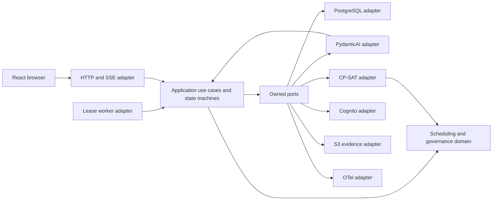
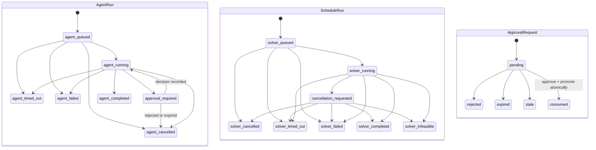
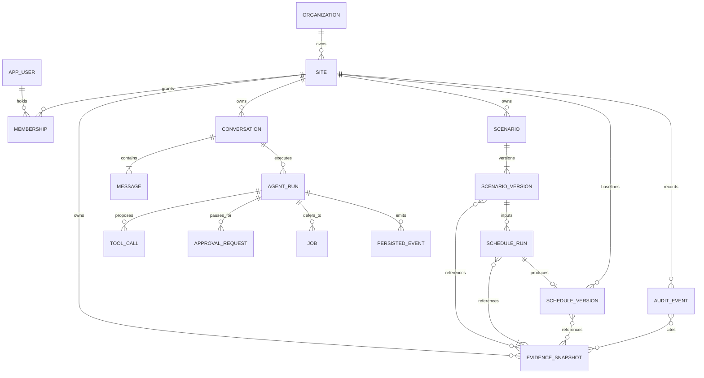
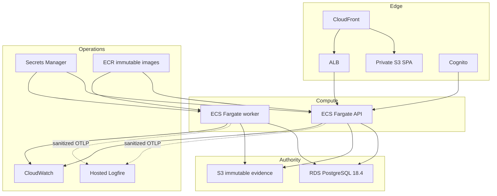

# Architecture Spine — ShiftMind Governed Scheduling Agent MVP

## Design Paradigm

ShiftMind is a **hexagonal modular monolith with durable workflow state machines**. Domain and application policy form the center; web, model, database, solver, identity, telemetry, and object storage are adapters. One backend image runs as independently scalable API and worker processes.



Dependencies point inward. Adapters may translate owned contracts; they may not define business authority or workflow state.

## Invariants & Rules

### AD-1 — Hexagonal module boundary [ADOPTED]

- **Binds:** all backend epics and cross-cutting infrastructure
- **Prevents:** framework, provider, or persistence types becoming product contracts
- **Rule:** HTTP, worker, agent, solver, identity, persistence, object-storage, and telemetry adapters call application ports/use cases. Domain and application code must not import FastAPI, PydanticAI, SQLAlchemy, Cognito, S3, Logfire, or concrete model providers. New work converges on the structural seed; existing `services`, `store`, and `llm` seams may remain behind compatibility adapters while migrated.

### AD-2 — Three-way authority partition [ADOPTED]

- **Binds:** FR-5–FR-21 and every agent capability
- **Prevents:** stochastic output, client state, or framework helpers authorizing or constructing a schedule
- **Rule:** the model interprets intent and proposes typed calls; application code owns identity, site scope, authorization, policy, risk, versions, budgets, approvals, idempotency, state transitions, persistence, and audit; CP-SAT alone constructs or validates an accepted schedule. No model output, model memory, browser value, or client approval flag grants authority.

### AD-3 — Server-derived site authority [ADOPTED]

- **Binds:** FR-1–FR-3, FR-20–FR-24, all repositories and adapters
- **Prevents:** cross-site reads/writes and UI-only enforcement of the one-user MVP
- **Rule:** Cognito uses OIDC authorization code with PKCE at the FastAPI BFF. Tokens stay server-side; the browser receives only a Secure, HttpOnly, SameSite cookie for an opaque application session. Unsafe methods require same-origin validation plus CSRF token. Every request, tool call, job lease, approval, audit lookup, and evidence read re-resolves actor/site from that session and current PostgreSQL membership. Repository calls require trusted site context; RLS supplies defense in depth. Cross-site/unauthorized lookup returns the same public not-found shape as absence where practical and never exposes membership or policy internals. Provisioning plus database constraints enforce one authenticatable user and one active membership while retaining organization/site ownership.

### AD-4 — One immutable scenario projection [ADOPTED]

- **Binds:** FR-5, FR-7, FR-14, FR-22, FR-24
- **Prevents:** viewer/agent fact drift, mutable fixture history, and accidental scenario administration
- **Rule:** predefined fixtures become immutable `scenario_version` records. Scenario Data queries and agent inspection tools consume the same application-owned normalized projection and version-bound evidence identifiers. Lists use deterministic stable ordering, bounded cursor windows with counts, and exact-target lookup so a deep-linked record can be revealed outside the current window. The MVP contains no scenario-source mutation command, route, tool, or UI control. PostgreSQL/site membership, immutable fixtures, the normalized read service, authenticated viewer, parity tests, and negative mutation-path tests form Gate A and must pass before AgentRuntime or agent inspection tools are introduced.

### AD-5 — Governed capability modules [ADOPTED]

- **Binds:** FR-5, FR-6, FR-9–FR-12, FR-17, FR-23
- **Prevents:** agent-loop branching, implicit privilege, and incompatible future tool additions
- **Rule:** an application-owned registry composes granted capabilities from authenticated context and feature policy. Risk classes are exactly `inspect`, `draft`, `compute`, `consequential`, and `prohibited`: compute needs the planner's current explicit run request, consequential needs exact-action approval, and prohibited capabilities are absent. Every versioned module declares typed input/output, permission, site/resource scope, risk, approval policy, budget/timeout, version/idempotency semantics, safe audit/evidence mapping, errors, and evaluation cases. Read and write capabilities remain distinct; loading or naming a module never grants authority.

### AD-6 — Persisted workflow is the recovery boundary [ADOPTED]

- **Binds:** FR-4, FR-12–FR-16, FR-20
- **Prevents:** loss or duplication when browsers, streams, API tasks, model calls, or workers fail
- **Rule:** accepted messages, agent runs, tool calls, jobs, approvals, schedule runs, outcomes, and progress events are committed before acknowledgement. A separately runnable worker advances jobs through compare-and-set transitions. Each lease has owner, expiry, heartbeat, and monotonically increasing fencing epoch; checkpoint/effect commits require the current epoch, while unique effect keys make expired-worker recomputation harmless. Cancellation is persisted and cooperative. Persisted monotonic event sequences feed SSE replay using `Last-Event-ID`; neither process memory nor the stream is authoritative.

### AD-7 — Closed workflow state machines

- **Binds:** FR-12, FR-13, FR-16, FR-18 and every workflow-status UI
- **Prevents:** one ambiguous run enum creating impossible approval, cancellation, or candidate states
- **Rule:** `AgentRun`, `ScheduleRun`, and `ApprovalRequest` use the separate closed graphs below; adapters may project a combined timeline but never merge their stored status types. Only feasible `ScheduleRun.completed` can reference a candidate `ScheduleVersion`. Application configuration—not the model—sets maximum iterations, model/tool calls, tokens, retries, wall time, site concurrency, and solver duration. Wall-time exhaustion becomes `timed_out`; other limit exhaustion becomes `failed` with stable `budget_exhausted` reason. Both persist and emit once without implicit retry.



### AD-8 — Idempotent commands and effects [ADOPTED]

- **Binds:** FR-12, FR-16, FR-18, FR-19 and all mutating capability modules
- **Prevents:** duplicate jobs, tool effects, approvals, and baseline promotions under retry or recovery
- **Rule:** each mutating HTTP command requires an idempotency key scoped to actor, site, operation, and canonical body hash plus expected resource version. Tool/worker effects use stable `(agent_run_id, tool_call_id)` or job-effect keys. Database uniqueness protects both; a replay returns the original semantic result and a conflicting body fails.

### AD-9 — Immutable schedule versions and isolated drafts [ADOPTED]

- **Binds:** FR-9–FR-11, FR-14, FR-15, FR-17–FR-20
- **Prevents:** in-place mutation, silent rebasing, and proposals detached from solver evidence
- **Rule:** constraints/goals form reversible proposal versions; solver inputs and outputs form immutable run/schedule versions; the site baseline is a versioned pointer. Every proposal names its expected scenario and baseline versions. Stale inputs fail closed and require refresh/recompute.

### AD-10 — Exact-action approval and atomic promotion [ADOPTED]

- **Binds:** FR-17–FR-21
- **Prevents:** implicit, stale, replayed, or mismatched consequential action
- **Rule:** approval is a one-time persisted state machine bound to actor, site, action type, normalized parameter hash, existing feasible candidate `ScheduleVersion`, baseline version, consequence-summary hash, policy version, and expiry. There is no durable approved-but-unconsumed state: an approve decision revalidates and atomically moves `pending` to `consumed` with the baseline-pointer change, audit, and persisted event; failure rolls back to `pending`. Rejected, expired, and stale are terminal. Candidate creation occurred at solver completion and is never repeated by promotion.

### AD-11 — Version-bound evidence and deterministic grounding [ADOPTED]

- **Binds:** FR-7, FR-14, FR-15, FR-20, FR-24
- **Prevents:** fabricated KPIs, evidence links that silently retarget, and unrepeatable comparisons
- **Rule:** an evidence reference identifies scenario version, producing or baseline schedule/run version, evidence group, record ID, and optional field/time range. Application calculators produce or verify every numerical claim and candidate/baseline delta against immutable snapshots. Missing, unauthorized, and version-mismatched evidence are distinct failures; no fallback may target another version or row.

### AD-12 — Records of truth stay separate [ADOPTED]

- **Binds:** FR-14, FR-20, FR-21 and operational requirements
- **Prevents:** traces/logs substituting for audit, observability outages breaking correctness, and evidence overwrite
- **Rule:** PostgreSQL owns product/workflow state and append-only unsampled business audit. `EvidenceSnapshot` is a site-owned immutable aggregate referenced by scenario versions, runs, schedule versions, approvals, and audit—not lifecycle-owned by one workflow row. Each accepted attempt has a server-generated `attempt_id`; idempotent replay returns that attempt, while a deliberate retry gets a new ID. Successful mutation audit is unique on `(site_id, effect_key, outcome)` in the business transaction; non-success audit is unique on `(site_id, attempt_id)`. Large evidence is conditionally written to S3 and checksum/version verified before the PostgreSQL transaction commits snapshot metadata, business mutation, and audit reference. S3 failure causes no mutation; database failure leaves only an unreferenced non-authoritative object retained until teardown. Every audit/provenance envelope carries actor/site; request, attempt, conversation, agent-run, tool, approval, job, and solver-run IDs; action/policy outcome; safe input/result hashes or summaries; before/after versions; model, prompt, tool, policy, and application versions; and immutable evidence references, never hidden reasoning. CloudWatch owns AWS diagnosis; sanitized OpenTelemetry/Logfire owns optional AI traces; version-controlled datasets/reports own evaluation. No telemetry system authorizes or blocks product work.

### AD-13 — One public contract chain [ADOPTED]

- **Binds:** every browser/API epic
- **Prevents:** hand-written client drift and transport-specific business behavior
- **Rule:** FastAPI publishes versioned REST/JSON commands and queries plus persisted SSE. OpenAPI generates frontend endpoint types, and the SPA uses one `openapi-fetch` client. Application errors map to RFC 7807 problem details with stable code, correlation ID, resource ID, and current version when relevant. Business commands remain durable without SSE.

### AD-14 — Server state has one client owner [ADOPTED]

- **Binds:** FR-4, FR-7, FR-13, FR-15, FR-18, FR-20, FR-24 and the UX companion
- **Prevents:** divergent browser caches, approval-by-rendering, and evidence navigation losing context
- **Rule:** TanStack Query owns remote cache; route/component state owns only navigation and presentation. Cached data is never authority or a substitute for resource versions. The conversation contract is a discriminated application-owned activity stream of planner message, agent response, clarification, draft, run progress, comparison, approval request, and terminal outcome. The composer submits messages or explicit commands but never encodes approval as ordinary text. Fixture catalogue, Chat, Scenario Data, Runs, and Results are peer scenario surfaces. Evidence navigation persists `EvidenceRefV1` plus source activity ID in URL/history state; exact-target loading never retargets, and returning restores route, scroll, and focus to the triggering control. Unauthorized targets use non-disclosing not-found behavior.

### AD-15 — Untrusted content cannot widen authority [ADOPTED]

- **Binds:** FR-3, FR-5, FR-6, FR-8, FR-23 and security NFRs
- **Prevents:** prompt injection, secret leakage, and arbitrary execution
- **Rule:** prompts, messages, fixture fields, model output, tool output, and future uploads are untrusted data. Tool gateway checks use only trusted dependencies and current state. Arbitrary SQL, shell, credentials, unrestricted network, identity administration, and runtime capability installation do not exist. Secrets stay server-side; external telemetry excludes prompt/tool/workforce/schedule content by default. Agent adapters discard provider hidden-reasoning/thinking parts and persist only planner-visible messages, application-owned concise decision summaries, typed calls/results required for recovery, and evidence links; durable history and provenance never store private chain-of-thought. Model outage disables only AgentRuntime: authenticated Scenario Data, saved results, and the manual deterministic solver path retain the same site, version, idempotency, and audit controls.

### AD-16 — Deterministic-first release evidence [ADOPTED]

- **Binds:** all FRs and release gates
- **Prevents:** a stochastic demonstration substituting for correctness and recoverability proof
- **Rule:** normal CI uses deterministic model doubles and versioned golden datasets; live-provider runs are explicit and budgeted. Every report binds dataset, evaluator, model, prompt, tool, policy, application, scenario, solver, code, and image versions. Authorization, approval, tenant isolation, grounding, hard constraints, idempotency, audit continuity, viewer/agent parity, worker recovery, accessibility, backup/restore, and rollback regressions block release regardless of aggregate helpfulness.

### AD-17 — Reproducible AWS process and data boundaries [ADOPTED]

- **Binds:** all deployment, security, reliability, and operations epics
- **Prevents:** console drift, public evidence, mixed process privilege, unrecoverable releases, and long-lived deploy credentials
- **Rule:** CloudFront serves a private-S3 SPA and routes API/SSE through ALB to ECS Fargate API; a separate Fargate worker uses RDS PostgreSQL and create-only S3 evidence. RDS is non-public in private subnets; API ingress is only through ALB/CloudFront and the worker has no inbound listener. Cognito public/self sign-up is disabled and terminates at a BFF session boundary. All public hops require TLS 1.2+, CloudFront-to-ALB uses HTTPS, RDS requires TLS, and S3/RDS/logs/secrets use encryption at rest; S3 Block Public Access plus CloudFront OAC protect buckets. Terraform plus GitHub Actions OIDC provision reviewed environment-specific plans, immutable ECR images, least-privilege API/worker roles, Secrets Manager, CloudWatch, backups, restore drills, AWS Budgets/cost tags, health-gated deploys, and schema-compatible rollback. The portfolio has no in-product delete: authoritative data/evidence persist until explicit teardown, RDS automated backups retain seven days plus a teardown snapshot, CloudWatch application logs retain thirty days, and hosted Logfire retention remains non-authoritative.

### AD-18 — PostgreSQL queue before distributed coordination

- **Binds:** FR-12, FR-13, FR-16 and future scaling work
- **Prevents:** premature brokers/workflow engines and database/message dual writes
- **Rule:** lease jobs from PostgreSQL with explicit concurrency and recovery. Introduce SQS only with a transactional outbox and idempotent consumers after measured backlog, polling impact, or independent-consumer need. Reconsider a workflow engine only for genuinely branching, multi-day, cross-system workflows.

### AD-19 — Agent runtime is a new owned contract

- **Binds:** FR-5–FR-12, FR-20, FR-23 and existing insight/constraint flows
- **Prevents:** PydanticAI types or the current task-specific `LLMProvider` leaking across unrelated product behavior
- **Rule:** introduce a ShiftMind-owned `AgentRuntime` port for multi-step orchestration. Preserve the existing provider-neutral task operations for constraint parsing and cached insights behind their own application ports until deliberately migrated. Provider clients may be shared inside adapters, but messages, deferred calls, tool objects, checkpoints, and framework event types never become domain, persistence, browser, or audit contracts. Before agent implementation, pin PydanticAI through a compatibility spike proving Python/Pydantic/provider fit, deferred calls, deterministic model doubles, durable owned-message translation, and content-disabled instrumentation; a different V2 release may replace the seed only with the same evidence.

### AD-20 — Canonical cross-epic contract set

- **Binds:** every API, worker, agent, governance, evidence, audit, and frontend epic
- **Prevents:** independent DTOs, hash rules, time models, or evidence locators that cannot interoperate
- **Rule:** `application/contracts` owns versioned schemas named `ScenarioProjectionV1`, `EvidenceRefV1`, `ProposalV1`, `RunSnapshotV1`, `AssignmentV1`, `MetricSetV1`, `ConstraintResultV1`, `ScheduleVersionV1`, `ComparisonV1`, `CapabilityManifestV1`, `JobLeaseV1`, `ApprovalBindingV1`, `AuditEnvelopeV1`, `ActivityItemV1`, `PersistedEventV1`, and `ProblemDetailsV1`; their required shape is fixed in Structural Seed. Adapters translate only at the edge, and schema fixtures/compatibility tests gate change. Contract hashes are SHA-256 over RFC 8785 canonical UTF-8 JSON and store algorithm/schema version beside the digest. Scheduling intervals use a UTC `horizon_start`, IANA `site_timezone`, and integer-minute half-open offsets `[start_minute, end_minute)`; only the solver adapter converts offsets to current float hours.

### AD-21 — Persisted event and cursor contract

- **Binds:** FR-4, FR-12, FR-13, FR-20 and all SSE/browser recovery work
- **Prevents:** incompatible envelopes, cursors, replay boundaries, and proxy heartbeat behavior
- **Rule:** `PersistedEventV1` carries `stream_id`, decimal `sequence`, `event_type`, `occurred_at`, `resource_version`, correlation IDs, and one typed `ActivityItemV1` payload. SSE `id` is `<stream_uuid>:<sequence>`; `Last-Event-ID` must match the URL stream and replay returns only greater sequences. Fifteen-second heartbeat comments have no ID and are not persisted. CloudFront disables cache for auth/API/SSE; forwards query strings, cookies, Origin, CSRF, `Last-Event-ID`, and required methods; and uses an origin response timeout above the heartbeat. ALB idle timeout is also above it. An end-to-end test through CloudFront and ALB must prove streamed heartbeats, reconnect, and replay because no generic CloudFront buffering toggle is assumed.

### AD-22 — Aggregate ownership and atomic choreography

- **Binds:** every state-mutating epic
- **Prevents:** two modules owning one entity or composing incompatible partial transactions
- **Rule:** identity owns organization/site/user/membership/session; scenario owns fixtures/versions; conversation owns messages/agent runs; scheduling owns proposals/runs/schedule versions/baseline pointer; workflow owns jobs/events; governance owns approvals/policy decisions; evidence owns snapshots/audit/provenance. Only an application orchestrator crosses owners. Atomic bundles are fixed: accept-turn = message + agent-run + event; enqueue-compute = immutable run snapshot + job + event; complete-compute = terminal run + evidence refs + event, plus candidate schedule version only for a feasible completed result; request-approval = binding + persisted pending-call payload + agent pause + audit + event; promote-baseline = consumed approval + pointer to the existing candidate + audit + event + agent-run resume; decide-approval-rejection = terminal approval (rejected, expired, or stale) + agent cancellation carrying its literal reason + audit + event. Repositories and adapters may not widen a bundle.
- **Amendment (2026-08-27, Epic 4 spine):** the request-approval, promote-baseline, and decide-approval-rejection entries above were widened from their 2026-07-22 form, which read `request-approval = binding + agent pause + event`, `promote-baseline = consumed approval + pointer to the existing candidate + audit + event`, and enumerated no rejection bundle. Reasons, in order: AD-12 requires an audit record for a consequential attempt, so an unaudited request-approval could not satisfy both rules; AD-7's `approval_required --> agent_running: decision recorded` edge must commit with the pointer move or a crash parks an approved run permanently; and a terminal non-consumed approval must cancel its paused run, which no existing bundle covered. Epic 4's `EAD-6` implements these; see `architecture-epic-4-2026-08-27/ARCHITECTURE-SPINE.md`.

### AD-23 — Enforced persistence and evidence roles

- **Binds:** FR-3, FR-14, FR-16, FR-19–FR-21 and AWS data infrastructure
- **Prevents:** RLS bypass, stale lease commits, audit duplication, and evidence overwrite
- **Rule:** NOLOGIN `shiftmind_owner` owns tables/functions; only the deployment migrator may `SET ROLE` to it, and no runtime credential can. API, worker, and lease roles are `NOINHERIT NOSUPERUSER NOBYPASSRLS` and own no tables. Every domain tenant table carries `site_id`, enables and forces RLS, and reads transaction-local trusted actor/site context; pooled transactions set and clear it. Internal `auth.session_index` and `workflow.job_queue` control tables are not direct tenant query surfaces and grant runtime roles no table access. API may only execute an explicit, minimal whitelist of owner-held `SECURITY DEFINER` authentication-lifecycle functions in `auth` (e.g. `resolve_session`, `create_login_handshake`, `consume_login_handshake`, `establish_session_for_subject`, `revoke_session`) — never direct table access; lease role may only execute owner-held `SECURITY DEFINER workflow.lease_next_job`, which uses `FOR UPDATE SKIP LOCKED` and returns job/site/actor/fencing context. Both functions revoke PUBLIC, grant EXECUTE only to their caller role, fix `search_path`, and contain no dynamic SQL. Domain work starts a new RLS-scoped transaction. Evidence keys are content/version addressed; S3 bucket versioning is enabled, bucket policy requires `If-None-Match: *`, and application roles lack `DeleteObject`. This is create-only product behavior, not regulatory WORM.

### AD-24 — Mixed-version deployment contract [DEFERRED — see Deferred table]

- **Binds:** database migrations, API/worker releases, rollback, and IaC
- **Prevents:** rolling replacement or rollback corrupting shared state
- **Scope note (2026-08-09):** the portfolio milestone (Gate B) is a single-instance local deployment and Gate C is a single-task hosted deployment, so no rolling replacement of mixed versions occurs and the N/N-1 compatibility, resumable-backfill, and alarm-coverage rules below have no implementing story. Epic 6 implements only the schema-compatible image rollback clause (Story 6.5). The rest of this rule is retained as the design to adopt when a second concurrent task or a real user first exists — it is deferred, not withdrawn.
- **Rule:** use expand-migrate-contract: apply additive schema first; API/worker/client versions N and N-1 remain release-tested and read/write compatible during rolling replacement; every durable job stores contract and required-capability versions, and an incompatible capability stays disabled until all tasks are N. Resumable backfills complete before new fields become required; destructive contraction waits until old tasks are gone and receives an explicit irreversibility gate. `/api/meta` publishes supported client versions; CloudFront serves `index.html` no-cache and retains prior content-hashed assets. Normal rollback uses prior compatible images before contraction; after contraction, remediation is roll-forward. Point-in-time restore is disaster recovery only, requires workflow pause plus consistency reconciliation, and is never represented as no-loss deployment rollback. CloudWatch alarms cover API health/latency, queue age, lease expiry, solver failure/duration, budget exhaustion, tool/guardrail denial, approval age/outcome, audit-write failure, model failure, and telemetry-export health.

### AD-25 — One-way brownfield cutover

- **Binds:** Gate A, persistence migration, OpenAPI generation, run status, and existing local data
- **Prevents:** incompatible legacy translations and fabricated immutable history
- **Rule:** before any governed durable work exists, Gate A performs a declared maintenance-window cutover: disable legacy writes, drain or cancel the in-process worker, snapshot SQLite, import predefined fixtures into checksummed PostgreSQL `scenario_version` records, deploy/test the V1 API plus regenerated client, then switch the no-cache SPA index. Existing SQLite scenarios/runs remain offline legacy demo data and are not migrated into governed history. No runtime adapter exposes both histories or both status vocabularies; post-Gate-A N/N-1 rules begin only after this cutover.

### AD-26 — Internal performance thresholds are allocated to components [ADOPTED]

- **Binds:** NFR35, NFR17, FR24, FR13, AD-4, AD-6, AD-21
- **Prevents:** a performance requirement that no component owns, and an internal demonstration threshold being mistaken for a customer service-level objective
- **Rule:** NFR35's four internal thresholds are allocated to specific components and measured under the canonical protocol in `requirements-inventory.md`. The scenario read service (AD-4) owns initial group-window load ≤ 2 s and exact evidence-target resolution ≤ 2 s, both measured server-side from request receipt to response completion; bounded cursor windows and exact-target lookup exist partly to make these achievable without unbounded reads. The persisted workflow boundary (AD-6) owns first persisted run event within 5 s of API acknowledgement, and the persisted event/SSE contract (AD-21) owns reconnect replay to current state within 5 s, both measured to client receipt. Thresholds are measured on the CI reference environment against the largest Gate A fixture, never on the hosted AWS topology, and are never published or implied as availability, latency, or recovery objectives — public objectives require measured portfolio traffic first (NFR17). A threshold miss blocks acceptance of its owning story.

## Consistency Conventions

| Concern | Convention |
| --- | --- |
| Modules | Backend package names are `snake_case`; application use cases use imperative names; adapters are named by external system; React components are `PascalCase`. |
| Identifiers | Internal aggregate IDs are server-generated opaque UUID strings. Version-bound source fixture IDs remain domain keys and are never treated as authorization. |
| Time and measures | PostgreSQL uses UTC `timestamptz`; APIs use RFC 3339 UTC. Measured fields carry unit suffixes (`_ms`, `_s`, `_h`, `_bytes`, `_usd`). |
| Versions and events | Mutable aggregates carry monotonic `bigint` versions; persisted events carry per-stream monotonic sequence numbers and names like `run.completed.v1`. AD-7 is the only legal status graph. |
| Scheduling time | `horizon_start` is a UTC instant, `site_timezone` is IANA, and schedule/demand intervals are integer-minute half-open offsets. Solver float hours exist only inside the adapter. |
| Canonical bytes | Cross-boundary hashes are SHA-256 over RFC 8785 canonical JSON; the digest always carries contract and algorithm version. |
| Transactions | Application command handlers own unit-of-work boundaries. Repositories never commit independently; tools call use cases, not repositories. |
| Errors | Application error codes are stable; HTTP renders RFC 7807 problem details. Denied, stale, missing, invalid, timed-out, cancelled, and failed remain distinct. |
| Config and secrets | Validate environment configuration at process start. Secrets come from local ignored env files or AWS Secrets Manager and never enter browser configuration or generated contracts. |
| Correlation | Propagate request, conversation, agent-run, tool-call, approval, job, solver-run, audit-event, site, actor, and schedule-version IDs; do not use high-cardinality IDs as metric labels. |

## Stack

Versions are the 2026-07-22 seed; existing rows are repository locks, while planned rows must be added to manifests and lockfiles by their implementation gate before use. Immutable image digests own deployed patch movement.

| Name | Version | Status |
| --- | --- | --- |
| Python | 3.12 | planned container target within repository constraint `>=3.10,<3.13` |
| FastAPI | 0.138.1 | repository lock |
| Pydantic | 2.13.4 | repository lock |
| PydanticAI | 2.27.0 | repository lock (`pydantic-ai-slim[google,openrouter]`); replaces the 2.14.1 seed under AD-19's same-evidence clause — spike verdict in `docs/AGENT-RUNTIME-DECISION.md` |
| OR-Tools CP-SAT | 9.11.4210 | repository lock; validated machine-specific pin |
| PostgreSQL / Amazon RDS | 18.4 | planned seed; current RDS-supported release |
| SQLAlchemy | 2.0.51 | planned seed |
| Psycopg | 3.3.4 | planned seed |
| Alembic | 1.18.5 | planned seed |
| Logfire SDK | 4.38.0 | planned optional telemetry seed |
| Node.js | 24.18.0 LTS | verified planned build target; commit toolchain pin and pass `npm ci`, test, typecheck, build |
| React | 19.2.7 | repository lock |
| React Router | 8.2.0 | repository lock |
| TanStack Query | 5.101.2 | repository lock |
| openapi-fetch | 0.17.0 | repository lock |
| TypeScript | 5.9.3 | repository lock |
| Vite | 8.1.5 | repository lock |
| Terraform | 1.15.8 | verified planned seed; constrain with `required_version` and validate providers/plan in CI |

## Structural Seed

New work converges on these ownership boundaries; this is not a mandate for an all-at-once brownfield rename.

Before the first agent slice, perform AD-25's coordinated cutover. Existing SQLite scenario/override/run/insight rows remain legacy demo data; governed PostgreSQL history starts from newly checksummed fixture imports. Accepted work is created for lease discovery in the same PostgreSQL transaction, removing the current commit-then-thread-submit loss window.

```text
backend/
  api/               # HTTP, BFF-session and SSE inbound adapters
  worker/            # job leasing and resumable execution adapter
  application/       # use cases, policy, state machines, ports, DTOs
  domain/            # governance and pure scheduling model
  agent/             # AgentRuntime and capability-module adapters
  engine/            # SchedulerEngine port implementations; existing CP-SAT
  adapters/          # PostgreSQL, Cognito, S3, telemetry and provider adapters
  migrations/        # Alembic history
  evals/             # versioned AI and architecture proof datasets
frontend/src/
  api/               # generated contract and single client
  features/          # chat, scenario-data, runs, results, provenance
  routes/            # route composition only
infra/terraform/     # environment roots plus reusable AWS modules
tests/architecture/  # cross-boundary executable proofs
```

### Normative contract minimums

Every contract carries `schema_version`; site-owned resources carry `site_id`; mutable aggregates carry `resource_version`. Schema files may add fields compatibly but may not weaken these minimums.

| Contract | Required shape |
| --- | --- |
| `ScenarioProjectionV1` | scenario/version IDs, checksum, `horizon_start`, IANA timezone, `projection_generated_at` (server-owned UTC time the projection response was generated from the immutable fixture version; rendered by the UX as the “last verified” timestamp and never client-derived), work areas/tasks, workers/qualifications/availability, demand intervals, baseline assignments, locks, constraints/objectives, evidence refs |
| `EvidenceRefV1` | snapshot ID/checksum, scenario version, producing/baseline run and schedule versions when applicable, group, record ID, optional field and minute interval |
| `ProposalV1` | proposal/version IDs, scenario/baseline versions, resolved entities, constraints/objectives, preserved locks, consequence summary and canonical hash |
| `RunSnapshotV1` | scenario checksum/version, baseline/proposal versions, locks/constraints/objectives, solver name/config/seed/limit, component versions, accepted time, input evidence refs |
| `AssignmentV1` | assignment ID, worker/task/shift IDs, integer start/end minutes, qualification refs, lock/source refs |
| `MetricSetV1` | interval/function coverage required/served minutes, overtime minutes, total cost, objective components, assignment/member counts |
| `ConstraintResultV1` | constraint ID/type, hard-or-soft class, satisfied flag, measured value/limit/unit, contributing assignment/evidence refs |
| `ScheduleVersionV1` | schedule/run/scenario/proposal IDs and versions, feasible solver status, immutable `AssignmentV1[]`, `MetricSetV1`, `ConstraintResultV1[]`, warnings, evidence refs |
| `ComparisonV1` | candidate/baseline versions; affected worker, shift and task diffs; interval coverage, overtime, cost/objective deltas; constraint status; unresolved infeasibility |
| `CapabilityManifestV1` | capability/version, risk class, input/output schema refs, permission/scope, approval policy, budget/timeout, idempotency/version rules, safe audit/evidence mapping, errors, eval fixture refs |
| `JobLeaseV1` | job/type/status, site/actor/attempt IDs, contract/capability versions, payload ref, idempotency key, lease owner/expiry/fencing epoch, cancellation flag |
| `ApprovalBindingV1` | approval ID and state (`pending`, `consumed`, `rejected`, `expired`, `stale`), actor/site/action, parameter hash, candidate/baseline versions, consequence hash, policy version, creation/expiry, decision/consumption times |
| `AuditEnvelopeV1` | audit/attempt/correlation IDs, actor/site and workflow IDs, action/policy outcome, safe hashes/summaries, before/after versions, model/prompt/tool/policy/app versions, evidence refs, occurred time |
| `ActivityItemV1` | common activity ID/discriminant, aggregate refs/versions, occurred time; planner message = message ID/text, agent response = visible summary/evidence refs, clarification = question/entity candidates, draft = proposal ref/summary, run progress = agent/solver refs/status/reason, comparison = comparison ref, approval request = binding ref, terminal outcome = aggregate ref/status/reason/evidence refs |
| `PersistedEventV1` | stream ID, decimal sequence, event type, occurred time, resource version, correlation IDs, one typed activity payload |
| `ProblemDetailsV1` | RFC 7807 type/title/status/detail/instance plus stable code, correlation ID, resource ID and current version when safe/relevant |





Environment classes are local developer, ephemeral CI, and one AWS portfolio environment. The AWS environment is production-shaped but is not represented as customer production.

### Aggregate ownership

| Owner | Aggregates | May be mutated by |
| --- | --- | --- |
| Identity | organization, site, app user, membership, session | identity use cases only |
| Scenario | fixture catalogue, scenario, scenario version | seeding/import use cases; read-only to planner/agent in MVP |
| Conversation | conversation, message, agent run, tool call | conversation/agent orchestrator |
| Scheduling | proposal, schedule run, schedule version, baseline pointer | scheduling use cases and promotion orchestrator |
| Workflow | job, persisted event | workflow state machine/worker |
| Governance | policy decision, approval request | policy/approval use cases |
| Evidence | evidence snapshot, audit event, provenance projection | evidence/audit use cases; append/create only |

```mermaid
sequenceDiagram
    participant UI as Browser
    participant APP as Application orchestrator
    participant DB as PostgreSQL
    participant W as Worker
    participant CP as CP-SAT
    UI->>APP: explicit run command + expected version + idempotency key
    APP->>DB: enqueue-compute bundle
    W->>DB: lease job + fencing epoch
    W->>CP: immutable RunSnapshotV1
    CP-->>W: deterministic result
    W->>DB: terminal run + evidence; candidate only if feasible
    UI->>APP: exact approval decision
    APP->>DB: consume approval + move baseline pointer + audit
```

## Capability → Architecture Map

| Capability / Area | Lives in | Governed by |
| --- | --- | --- |
| FR-1–FR-3 identity, one-user and site scope | BFF auth adapter, membership use cases, scoped repositories/RLS | AD-2, AD-3, AD-15 |
| FR-4 durable conversations | conversation application module, PostgreSQL, SSE adapter | AD-1, AD-6, AD-13 |
| FR-5–FR-8 investigation, grounding and fallback | scheduling capability module, scenario projection, grounding service | AD-2, AD-4, AD-5, AD-11, AD-15 |
| FR-9–FR-11 proposal and deterministic schedule | proposal module, scheduling domain, CP-SAT adapter | AD-2, AD-5, AD-9 |
| FR-12–FR-16 durable optimization | run/job state machines, worker, persisted events | AD-6–AD-9, AD-18 |
| FR-17–FR-19 approval and baseline | approval/promotion module, schedule repository | AD-2, AD-8–AD-10 |
| FR-20–FR-21 provenance and audit | provenance query, audit ledger, evidence store | AD-10–AD-12 |
| FR-22 fixture catalogue | scenario query module and seeded versions | AD-3, AD-4 |
| FR-23 capability extensibility | capability registry and module conformance tests | AD-5, AD-15, AD-16 |
| FR-24 Scenario Data | normalized scenario projection and peer SPA route | AD-4, AD-11, AD-13, AD-14 |
| NFR35 internal performance thresholds | scenario read service, persisted workflow boundary, SSE contract | AD-4, AD-6, AD-21, AD-26 |
| AWS release and operations | Terraform, CI/CD, API/worker containers, RDS/S3 | AD-12, AD-16–AD-18 |

## Deferred

| Decision | Why it waits | Revisit trigger |
| --- | --- | --- |
| SQS and transactional outbox | PostgreSQL leasing is sufficient for one worker and one workflow | sustained queue age, harmful polling, or an independent consumer |
| Durable workflow engine | current flow is bounded and application state machines are inspectable | branching multi-day or cross-system orchestration |
| Multiple workers/API tasks, RDS Proxy, Multi-AZ | no measured portfolio load or customer SLO | AWS benchmark or external-pilot SLO/RTO/RPO |
| Customer staging/production topology | only local, CI, and a portfolio AWS environment are claimed | first external production pilot |
| Multiple roles and separation of duties | one seeded planner may self-approve | activating a second user or customer security review |
| Customer retention, deletion, residency, regulatory WORM | the current portfolio lifecycle is fixed by AD-17 but is not a customer policy | selected customer, region, or compliance regime |
| WMS/HR/demand integrations | no external operational integration is in MVP scope | product discovery selects the first system |
| Custom scenario/DC-management writes | fixtures are intentionally read-only | DC-management milestone; implement as separate governed modules |
| WebSockets, GraphQL, gRPC, public MCP, Celery/Redis, Kafka, Kubernetes, service mesh, CQRS, event sourcing, generalized RAG, multi-agent orchestration | none is required by the bounded journey | a measured requirement not met by the current spine |
| Dedicated per-site infrastructure | pooled logical isolation is the intended default | contractual isolation or measured noisy-neighbor risk |
| Public latency, availability, concurrency, recovery and cost objectives | no representative traffic exists | measured AWS portfolio traffic before customer acceptance |
| AD-24 mixed-version rollout: N/N-1 read/write compatibility, resumable backfills, `/api/meta` client gating, contraction gates | one API task and one worker task are replaced, not rolled; there is no concurrent prior version to stay compatible with, and no user to strand | a second concurrent API/worker task, or the first external user |
| Operational alerting with per-signal destinations, deduplication keys, and tested runbooks | a single-operator portfolio has no on-call rotation or paging destination; Story 5.1's instrumentation covers diagnosis | first external pilot, or any operation the author does not personally observe |
| Rehearsed disaster-recovery restore drill with evidence reconciliation | automated backups are configured (Story 6.5); a rehearsed restore proves recoverability the portfolio does not yet need to claim | first external user or any non-reproducible data |
