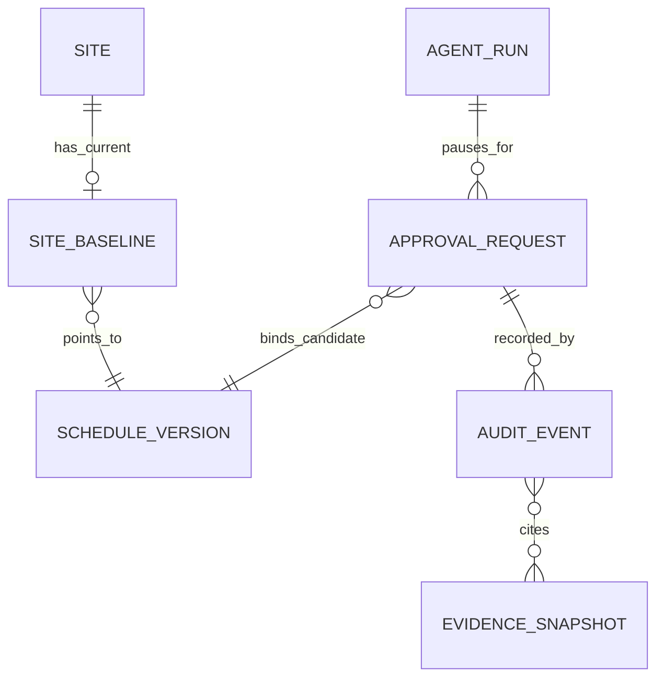

# Architecture Spine — Epic 4: Exact Baseline Decision and Decision Record

## Design Paradigm

Epic 4 adds the **consequential authority boundary** to the existing hexagonal monolith: a **one-time-consume approval state machine** riding the durable-workflow substrate Epics 1–3 already proved. Nothing new executes; the epic decides, records, and moves one pointer. The model may *propose* an approval request; only an authenticated human decision, revalidated inside one transaction, may consume it. There is no durable approved-but-unconsumed state, no background scheduler, and no new runtime process.

## Inherited Invariants

Parent: `../architecture-ShiftMind-2026-07-22/ARCHITECTURE-SPINE.md` — binding, original IDs, never renumbered. A local rule that weakens one is a conflict to surface, never an override. Three such conflicts were surfaced by this run and resolved by amending the parent's AD-22 on 2026-08-27; nothing here diverges from the parent as it now stands.

| Inherited | Binds here |
| --- | --- |
| AD-2 three-way authority partition | model proposes typed approval requests only; application owns approval, promotion, audit; no model output, browser value, or client approval flag grants authority |
| AD-3 server-derived site authority | actor and site re-resolved from the session on every command, approval lookup, and provenance read; unauthorized targets get the non-disclosing not-found shape |
| AD-6 persisted workflow is the recovery boundary | approval requests, decisions, and their events commit before acknowledgement; reconnect/replay restores `approval_required` from persistence |
| AD-7 closed workflow state machines | `ApprovalRequest` (`pending → consumed \| rejected \| expired \| stale`) and `AgentRun` graphs are used exactly as drawn; no new states, no merged status types |
| AD-8 idempotent commands and effects | both parent key shapes stay legal here — HTTP commands key on actor/site/operation/body-hash plus expected versions; agent-initiated tool effects key on `(agent_run_id, tool_call_id)` (see EAD-3) |
| AD-9 immutable versions, versioned baseline pointer | promotion moves a pointer to an *existing* candidate; stale inputs fail closed and require refresh/rerun |
| AD-10 exact-action approval and atomic promotion | the binding's fields, one-time consumption, in-transaction revalidation, and rollback-to-pending are fixed by the parent; Epic 4 implements, never redefines them |
| AD-11 version-bound evidence and grounding | every consequence summary and before/after claim is application-computed against immutable versions |
| AD-12 records of truth stay separate | PostgreSQL owns append-only business audit; success audit unique on `(site_id, effect_key, outcome)`, non-success on `(site_id, attempt_id)`; telemetry can never authorize, block, or substitute |
| AD-14 server state has one client owner | approval is never encoded as ordinary chat text nor inferred from rendering; TanStack Query cache is never authority for a decision |
| AD-15 untrusted content cannot widen authority | model output may propose a request; it never supplies actor, versions, hashes, or a decision, and hidden reasoning never enters the binding or audit |
| AD-16 deterministic-first release evidence | Story 4.5/4.6 proofs run on deterministic doubles with versioned bindings; approval/audit regressions block release |
| AD-20 canonical contract set | `ApprovalBindingV1` and `AuditEnvelopeV1` are built to the parent's normative minimums; hashes are SHA-256 over RFC 8785 canonical JSON |
| AD-22 aggregate ownership and atomic choreography (amended 2026-08-27) | governance owns approvals, scheduling owns the baseline pointer, evidence owns audit; only the application orchestrator crosses owners. Its bundle list now carries request-approval's pending-call payload and audit write, promote-baseline's agent-run resume, and the decide-approval-rejection bundle EAD-6 implements |

## Invariants & Rules

### EAD-1 — Storage homes, and who lands each migration

- **Binds:** Stories 4.1, 4.2, 4.3, 4.4; every adapter touching approvals, baseline, or audit
- **Prevents:** two owners of one entity; the baseline pointer landing on the identity-owned `site` row; two stories racing to create the same table
- **Rule:** `approval_request` is a governance-owned table holding the full `ApprovalBindingV1` (state CHECK exactly `pending|consumed|rejected|expired|stale`; at most one `pending` per agent run, enforced by a partial unique index; one opaque `request_effect_key` column per EAD-3). The site baseline pointer is a scheduling-owned, dedicated one-row-per-site record (`site_baseline`: unique `site_id`, FK to `schedule_version`, monotonic `resource_version`) — never a column on `site`, never derived from "latest schedule version". `audit_event` is an evidence-owned append-only table implementing AD-12's two uniqueness rules; the normal application path has no UPDATE/DELETE on it. **Story 4.1 lands the single additive migration creating all three tables plus `agent_run.status_reason`**, because 4.1 must read the pointer (or its absence) to populate a binding before 4.3 ever writes it; no later story re-creates them. `scenario_catalogue`'s `literal(None)` baseline field is replaced by a real read of `site_baseline`; no other module may read or write the pointer directly.

### EAD-2 — "No baseline" is an explicit, encoded state [ADOPTED]

- **Binds:** Stories 4.1–4.3; comparison staleness; every consumer of `baseline_schedule_version`
- **Prevents:** first promotion needing a synthetic baseline row; a binding that cannot tell "expects no baseline" from "baseline unknown"
- **Rule:** an absent `site_baseline` row is the valid "no baseline" state. `ApprovalBindingV1.baseline_version = null` means *expects absence*: promotion revalidates that no baseline row exists and inserts the first one. A non-null `baseline_version` names the exact baseline being replaced: promotion revalidates it by compare-and-set on `site_baseline.resource_version`. Any mismatch in either direction is a business mismatch and marks the binding `stale` per EAD-10 — never a silent rebase, never a second candidate.

### EAD-3 — Three-role identity, attribution, and the two legal request paths [ADOPTED]

- **Binds:** Stories 4.1–4.5; `persisted_event`, `audit_event`, provenance projection
- **Prevents:** worker activity attributed to a human; human commands attributed to a proposal author; a fabricated system-user identity; and two incompatible idempotency shapes on one table
- **Rule:** `actor_id` always names the server-derived authenticated human principal of a user-initiated command, resolved from the session inside the command transaction — never supplied by browser or model input, never a worker. Every consequential audit envelope carries `initiated_by_actor_id` (who requested) and `decided_by_actor_id` (who approved/rejected) as separate fields even while the one-user MVP makes them equal; the automated executor is represented only by worker facts — `lease_owner`, `attempt_id`, `fencing_epoch` — inside the envelope/payload, with no `app_user` row. Worker-driven persisted events set `actor_id` to the initiating human principal of the enqueuing command (the run requester per Story 3.6, not the proposal author); after a resumed run, continued worker events keep the **initiating** principal, and the approve decision is attributed only through `decided_by_actor_id`. Story 4.1's two initiators are two key shapes on one row, both legal under AD-8: a planner-initiated request is an HTTP command keyed by body-hash plus expected versions; an agent-initiated request is a typed capability tool call keyed by `(agent_run_id, tool_call_id)`. Both write the same `approval_request` row through one use case, storing whichever key in the single opaque `request_effect_key` column — never a synthetic body hash faked from tool arguments. This decides the Epic-4-owned attribution item from Story 3.5's review.

### EAD-4 — The approval pause is persisted state, replayed literally [ADOPTED]

- **Binds:** Stories 4.1, 4.2, 4.6; Chat/Results activity replay
- **Prevents:** an approval that exists only in stream memory or component state; duplicated or lost pending decisions on reconnect
- **Rule:** request-approval commits the immutable binding, the `agent_run` transition to `approval_required`, and one persisted event before acknowledgement. It also persists the adapter's `AgentApprovalPendingV1` payload (pending calls plus the resumable owned turn history) with the binding — the STOPGAP in `execute_turn.py` names exactly this as Epic 4's obligation, and restoring the `approval_required` finalisation mapping is part of Story 4.1. Reconnect or reload reconstructs the pause, the exact binding, and only the currently valid decision controls from persistence alone — the same binding and agent-run identifiers, rendered once. Policy refuses to create a binding for a missing, infeasible, timed-out, cancelled, failed, or stale candidate; solver completion and model prose can never move the pointer.

### EAD-5 — Non-consumed terminal outcomes cancel the paused run; approve resumes it through the existing seam [ADOPTED]

- **Binds:** Stories 4.2, 4.3, 4.6; `agent_run` schema; state-semantics matrix
- **Prevents:** an agent run parked forever in `approval_required` after its binding died, or in `agent_running` after approval; a cancellation whose cause is unrecoverable from the row; a second, invented resume mechanism
- **Rule:** rejected, expired, and stale are terminal for the binding, and the same transaction terminalizes the paused agent run as `agent_cancelled` with the matching literal reason from the closed vocabulary `approval_rejected | approval_expired | approval_stale`. `agent_run` gains a nullable `status_reason` column so reconnect renders the literal outcome without replaying events. On approve, the promotion transaction records the decision and returns the run to `agent_running` (AD-7's "decision recorded" edge); the run is then driven to a terminal state through the **existing owned seam** — the persisted decision is supplied as a server-owned `AgentApprovalDecisionV1` in `AgentTurnRequestV1.approvals` on a resumed turn, which finalises through the normal `execute_turn` path. No new resume mechanism, and no run may be left non-terminal once its binding is terminal. This adds no general user-initiated AgentRun cancellation.

### EAD-6 — Three fixed transactions, one effect key, one closed outcome vocabulary [ADOPTED]

- **Binds:** Stories 4.1–4.3, 4.5; every repository these commands touch
- **Prevents:** promotion, audit, event, and run-state drifting across partial commits; double promotion under retry; two stories choosing incompatible audit keys for the same table
- **Rule:** Epic 4's atomic bundles are exactly: **TX1 request-approval** = pending binding + persisted pending-call payload + `approval_required` transition + audit + event; **TX2 decide-approve** = revalidation + `pending → consumed` + `site_baseline` CAS + audit + event + run resume; **TX3 decide-reject/expire/stale** = terminal binding + `agent_cancelled(reason)` + audit + event. Each is one transaction; any failure rolls the whole bundle back (approve failure returns the binding to `pending` with no baseline change). The `effect_key` for all three bundles is the server-generated `approval_id`, minted at the start of TX1, disambiguated by the closed outcome vocabulary `approval_requested | approval_consumed | approval_rejected | approval_expired | approval_stale`; AD-12's `(site_id, effect_key, outcome)` uniqueness therefore makes a second pointer movement structurally impossible while still permitting one request and one decision row per approval. HTTP replay follows AD-8: a replay returns the original semantic result; an altered body or version conflicts; a decision against an already-terminal binding fails with literal expected/current context and zero effect.

### EAD-7 — Expiry is lazily materialized, and reads never write

- **Binds:** Stories 4.1, 4.2, 4.5, 4.6
- **Prevents:** a background expiry sweeper this epic has no runtime to host; a GET or reconnect causing a database write, audit row, and event on every page load
- **Rule:** `expires_at` is authoritative by comparison. **Every read path is pure**: a query, render, reconnect, or SSE replay that observes `now() >= expires_at` on a pending binding presents it as expired and offers no decision control, and writes nothing. The terminal `expired` state materializes only inside a **decision-attempt transaction** — an approve or reject command against an overdue binding runs TX3 with reason `approval_expired` instead of its requested outcome, and returns that literal result. There is no cron, scheduler, or worker job for expiry in Epic 4, and no write-on-read path anywhere. An overdue-but-undecided binding therefore reads as expired while its stored state is still `pending`; the state matrix (Story 4.6) treats "pending, overdue" as one literal presented state, not a fourth stored one.

### EAD-8 — Baseline-supply consistency guard

- **Binds:** Stories 4.2, 4.3, 4.4; `calculate_comparison`; any consumer of `get_baseline_assignments`
- **Prevents:** a comparison presenting an unreadable baseline supply as an empty one (the hazard `deferred-work.md`'s 3.8/3.10 entries record)
- **AMENDED 2026-09-03** (`sprint-change-proposal-2026-09-03.md`, Epic 4 retrospective A3(i)). This clause previously read *"the first real promotion silently turning Story 3.8's **honest** empty-baseline comparison into a false 'all assignments net-new' claim"*. **Both halves of that premise were false.** The pre-promotion comparison was never honest: with no baseline pointer `expected_baseline_schedule_version` is `None`, the guard below does not fire, and `calculate_comparison` runs against an empty baseline — rendering a cost delta equal to the candidate's entire cost, an all-`Satisfied` baseline constraint list, and an assignment diff reporting every worker `added`. That last item **is** the "all assignments net-new" claim this decision names, and it existed *before* any promotion rather than being created by one. EAD-8 guarded the post-promotion side of the boundary correctly and mis-described the pre-promotion side; the guard it specified is what kept the post-promotion path honest, and is retained unchanged. Story 5.0 makes "no baseline" an explicit rendered state per EAD-2 — which is what this premise assumed already existed — and Story 3.8's own AC2 (UX-DR21, *"missing metrics say 'Not computed' rather than zero or an invented value"*) has been unmet since it shipped.
- **Rule:** Epic 4 moves the pointer as metadata only; it does **not** wire `get_baseline_assignments` to the promoted version. From Story 4.3 on, any comparison or approval-review rendering whose frozen `baseline_schedule_version` is non-null while the baseline assignment supply for that exact version is not authoritatively readable must fail closed with a distinct outcome — never render an empty read as "the baseline is empty". This binds Story 4.2's consequence-summary rendering as much as 4.3's promotion. Wiring the real supply (reading `schedule_assignment` for the baseline version, plus the wage and selected-shift prerequisites Stories 3.8/3.10 name) is deferred with its trigger below. Pointer movement does activate Story 3.8's staleness detection, discharging its "vacuously false in production" deferral.

### EAD-9 — Named production supplier or declared seeded proof [ADOPTED]

- **Binds:** story creation and review for 4.1–4.6
- **Prevents:** a guard proven only against a stub being recorded as production behavior (the Epic 3 retro's recurring failure mode)
- **Rule:** every Epic 4 contract or guard names its supplier from this table, and a story introducing a new one extends the table or fails review:

| Contract / guard | Production supplier | Seeded proof + remaining gap |
| --- | --- | --- |
| Human actor identity | `auth.resolve_session` in-transaction | — (real today) |
| Executor attribution | `workflow.job_queue` lease (`lease_owner`, `attempt_id`, `fencing_epoch`) | — (real today) |
| Initiating vs deciding planner distinction | two structural fields | seeded two-actor tests; gap: second real user (parent Deferred: separation of duties) |
| Approval expiry duration | `Settings` (env-validated at start), snapshotted to absolute `expires_at` at TX1 per EAD-12 | value fixed at Story 4.1 creation |
| `policy_version` | derived per EAD-12 from `PolicyInputsV1` + `POLICY_GENERATION` (`application/capabilities/registry.py`) | gap: database-backed policy supplier at second user / security review — a change of supplier, not of shape |
| Candidate feasibility | `schedule_version` + `ck_schedule_run_candidate_completed` | — (real today) |
| Resumable pending payload | `AgentApprovalPendingV1` / `AgentTurnRequestV1.approvals` (owned contracts, already exist) | gap: never yet persisted — Story 4.1 supplies persistence |
| Baseline pointer | `site_baseline` (created by Story 4.1's migration, written by 4.3) | — (real once 4.1 lands) |
| Baseline assignment supply | exact site-scoped `schedule_version.payload` named by the run snapshot | comparison reads the immutable aggregate; the Scenario Data projection supply remains deferred |

### EAD-10 — One decision endpoint, one owner per bundle, one revalidation fork [ADOPTED]

- **Binds:** Stories 4.2, 4.3, 4.5
- **Prevents:** 4.2 and 4.3 both building competing reject paths, or each assuming the other did; and two stories encoding different rules for when a failed approval becomes `stale` versus returns to `pending`
- **Rule:** there is exactly one decision endpoint. **Story 4.2 owns it and implements TX3 in full** (reject, expire, stale — binding terminal, `agent_cancelled(reason)`, audit, event) plus the review rendering. **Story 4.3 owns TX2 only**, invoked as the approve branch of that same endpoint; it adds no second route and no second reject path. Revalidation is one shared step with a fixed fork: any **business** mismatch — candidate missing or no longer feasible, baseline version or absence mismatch, parameter or consequence hash mismatch, the **initiating actor no longer having an active (non-revoked) membership in the binding's site**, policy version, or expiry — terminalizes the binding to `stale` (or `expired` where expiry is the cause) and never retries; only a **transactional or infrastructure write fault** rolls the bundle back, leaving the binding `pending` for an honest retry. Story 4.5 proves both arms of this fork distinctly.
- **Membership referent and supplier:** EAD-10's membership check is the **initiating/requesting actor's current site membership**, not the deciding actor's and not a separation-of-duties comparison. TX1 already snapshots the stable identifiers needed for this invariant as `ApprovalBindingV1.initiated_by_actor_id` and `ApprovalBindingV1.site_id`; no client value or membership ID is accepted. Inside the same TX2/TX3 command transaction, the shared `revalidate_binding` function must ask a server-owned transactional membership reader whether a row exists for that actor/site pair with `revoked_at IS NULL`. Absence is a business mismatch: return expected/current membership context without disclosing unrelated tenant data and take EAD-10's `stale`/`approval_stale` TX3 path, with zero baseline effect.
- **Deciding actor is a different guard:** the authenticated session layer re-resolves the deciding actor and their active site membership through `auth.resolve_session` before the command is admitted. If that resolution fails or its server-derived actor/site does not authorize the target, refuse with the existing authentication/non-disclosing authorization outcome and perform **no approval mutation**. Do not duplicate that guard as an EAD-10 mismatch and do not terminalize a binding on behalf of a revoked deciding actor. Story 4.3 AC1's phrase “current actor/site/membership” names this admission guard; the membership check still required *inside* `revalidate_binding` is the initiating actor invariant above.

### EAD-11 — The consequence summary has one persisted home [ADOPTED]

- **Binds:** Stories 4.1, 4.2, 4.4
- **Prevents:** three stories inventing three homes for the text a planner reads before approving, or recomputing it at render so the approved text and the audited hash can diverge
- **Rule:** the consequence-summary **text** is an application-owned literal snapshot persisted on the `approval_request` row beside its canonical hash at TX1, computed by application calculators against immutable versions (AD-11). It is not recomputed at render, not read live from `ProposalV1.consequence_summary`, and never model prose. Story 4.2 renders it and Story 4.4 replays it from that same immutable row, so what was approved, what was hashed, and what provenance shows are one artifact.

### EAD-12 — Snapshot-time inputs are immune; only decide-time inputs version the policy [ADOPTED]

- **Binds:** Stories 4.1, 4.2, 4.3, 4.5; `Settings`; the capability registry
- **Prevents:** an unrelated config edit (a CORS origin, a solver seed) invalidating every pending approval, and its opposite — a real rulebook change slipping past a hand-edited constant so a binding minted under one policy is consumed under another
- **Rule:** a setting consulted **once at TX1 and snapshotted into the binding** — the expiry duration written as an absolute `expires_at`, the parameter and consequence hashes, candidate and baseline versions — is immune by construction and never bumps `policy_version`. This follows the existing `session_ttl_s` precedent, where a duration becomes an absolute deadline at mint time and later config edits do not move live sessions. Only settings **consulted at TX2/TX3 revalidation** version the policy, and they are enumerated explicitly in one frozen `PolicyInputsV1` subset — today the capability feature flags that gate whether baseline approval is grantable at all. `policy_version` is derived, never hand-typed: `f"{POLICY_GENERATION}+{sha256(canonicalize_json(asdict(inputs)))[:12]}"`, where `POLICY_GENERATION` remains the semantic string (`one-user-mvp-v1`) and the digest uses AD-20's existing SHA-256-over-RFC-8785 convention (`application/contracts/canonical.py`). A field absent from `PolicyInputsV1` does not change the rulebook; adding one is a deliberate, reviewable act. A bump makes pending bindings fail EAD-10's revalidation as `stale` — no baseline moves, and the planner refreshes and re-requests.

## Approval / promotion path

```mermaid
sequenceDiagram
    participant P as Planner (session actor)
    participant APP as Application orchestrator
    participant DB as PostgreSQL
    P->>APP: request approval (HTTP body-hash key, or agent tool-call key)
    APP->>DB: TX1 pending binding + pending-call payload + approval_required + audit + event
    Note over P,DB: reads are pure - reconnect restores pause; overdue reads present expired
    alt approve (TX2, Story 4.3)
        P->>APP: approve (authenticated decision)
        APP->>DB: revalidate actor/site/hashes/candidate/baseline/expiry
        APP->>DB: pending→consumed + site_baseline CAS + audit + event + run resumes
        Note over DB: write fault rolls back to pending; business mismatch goes to TX3
    else reject / expired / stale (TX3, Story 4.2)
        APP->>DB: terminal binding + agent_cancelled(reason) + audit + event
    end
    P->>APP: replay of a decided command
    APP-->>P: original semantic result (no second effect)
```

## Consistency Conventions

| Concern | Convention |
| --- | --- |
| New contracts | `ApprovalBindingV1`, `AuditEnvelopeV1` in `backend/application/contracts/`, built to AD-20's normative minimums; frontend types stay OpenAPI-generated |
| Reasons and states | closed vocabularies only: binding states per AD-7; cancellation reasons `approval_rejected \| approval_expired \| approval_stale`; audit outcomes per EAD-6; stored as literal strings, rendered as literal text (no invented UI states) |
| Event stream | approval lifecycle events ride the **conversation stream** anchored to the paused agent run (`stream_id = conversation_id`, `agent_run_id` set); no new stream kind |
| Errors | stale/expired/terminal-replay failures return RFC 7807 problem details carrying literal expected/current context (binding state, versions); denied, stale, expired, and conflicting remain distinct codes |
| Hashes | parameter and consequence-summary hashes are SHA-256 over RFC 8785 canonical JSON with algorithm/schema version beside the digest (AD-20) |
| Approve control | "Approve as baseline" stays distinct from "Run optimization" in language, control, consequence, and visual treatment (UX-DR12); approval is never encoded as ordinary chat text |

## Structural Seed

Additive only; no rename of existing modules. The code owns detail once it exists.

```text
backend/
  application/contracts/approval_binding.py    # ApprovalBindingV1 (AD-20 minimums)
  application/contracts/audit_envelope.py      # AuditEnvelopeV1 (AD-20 minimums)
  application/use_cases/request_approval.py    # TX1 (Story 4.1)
  application/use_cases/decide_approval.py     # TX3 + approve-branch entry (Story 4.2)
  application/use_cases/promote_baseline.py    # TX2 (Story 4.3)
  application/queries/decision_provenance.py   # Story 4.4 read projection
  adapters/postgres/                           # approval_request, site_baseline, audit_event repos
  migrations/                                  # one additive migration (Story 4.1): 3 tables + agent_run.status_reason
  api/routers/approvals.py                     # request command, one decide command, provenance read
```



## Story → Architecture Map

| Story | Governed by |
| --- | --- |
| 4.1 request approval for one exact feasible candidate | AD-2, AD-8, AD-10, AD-15, EAD-1, EAD-2, EAD-3, EAD-4, EAD-6, EAD-9, EAD-11, EAD-12 |
| 4.2 review and decide the exact approval | AD-2, AD-14, EAD-4, EAD-5, EAD-6, EAD-7, EAD-8, EAD-10, EAD-11, EAD-12 |
| 4.3 promote the baseline atomically with audit | AD-10, AD-12, AD-22, EAD-1, EAD-2, EAD-5, EAD-6, EAD-8, EAD-10, EAD-12 |
| 4.4 inspect complete decision provenance (inherited implications) | AD-3, AD-11, AD-12, AD-15, EAD-3, EAD-8, EAD-11 |
| 4.5 prove approval and audit invariants (inherited implications) | AD-16, EAD-6, EAD-7, EAD-10, EAD-12, verification obligations below |
| 4.6 workflow state semantics + automated accessibility (inherited implications) | EAD-4, EAD-5, EAD-7 literal states/reasons enter the state matrix; automated-only proof per the Accessibility Floor |

## Verification Obligations

The Epic 4 proof matrix (Story 4.5/4.6 and the retro's proof-matrix task) must cover each of these with a demonstrated-red case; a passing guard that cannot be made to fail by a relevant mutation does not count:

1. **Initial promotion** — approve with `baseline_version = null` against an empty `site_baseline`; row inserted, audit + event written once.
2. **Replacement** — approve naming the exact current baseline; CAS succeeds; prior schedule versions unchanged.
3. **Stale / expired / rejected** — each terminal path produces its literal binding state, `agent_cancelled` with the matching reason, zero baseline effect, and offers only currently valid actions; the EAD-10 fork is proven on both arms (business mismatch → `stale`; write fault → `pending`).
4. **Reconnect** — kill the stream/browser during `approval_required`; replay restores the pause, binding, and identifiers exactly once; an overdue pending binding reads as expired and the read writes nothing.
5. **Idempotent replay** — same key/body returns the original semantic result for request and both decisions, across both AD-8 key shapes; altered body/version conflicts; a decision on a terminal binding fails with literal context.
6. **Rollback** — fault injection on each write inside TX2 (binding, pointer, audit, event) rolls the whole bundle back to `pending`; retry completes exactly once after the fault clears. (*Transaction* rollback — baseline revert is not an Epic 4 operation.)
7. **Audit integrity** — success uniqueness `(site_id, effect_key, outcome)` and non-success uniqueness `(site_id, attempt_id)` hold under concurrency across the whole outcome vocabulary; telemetry disabled/degraded changes nothing; the three identity roles are distinguishable in every envelope.

## Deferred

| Decision | Why it waits | Revisit trigger |
| --- | --- | --- |
| ~~Wiring `get_baseline_assignments` to the promoted baseline (plus authoritative wages and selected shifts)~~ **CLOSED 2026-09-03 by Story 5.0** | EAD-8 fails closed instead; prerequisites named by Stories 3.8/3.10 are undischarged | **TRIGGER FIRED** — Story 5.4's walkthrough needs authoritative baseline-side metrics after a real promotion. **The premise was also wrong:** this row assumed the supply must come from `schedule_assignment` rows, which is why the wage and selected-shift prerequisites were named as blockers. The promoted `schedule_version.payload` already persists the full `ScheduleVersionV1`, whose `.assignments` is already `tuple[AssignmentV1, ...]` — the exact type the comparison consumes — FK-pinned by `site_baseline.schedule_version_id`, with `snapshot.baseline_schedule_version` already being `str(schedule_version_id)`. Story 5.0 changes which source the comparison reads; it builds no supply and discharges no 3.8/3.10 prerequisite. |
| Wiring the **projection** `get_baseline_assignments` group (Scenario Data workspace consumer) and the overview's hardcoded `baseline_assignment_count=0` | successor to the row above, opened 2026-09-03: this consumer genuinely does need the `schedule_assignment`-row supply plus the wage and selected-shift prerequisites Stories 3.8/3.10 name, none of which Story 5.0 touches | first story requiring baseline assignments in the Scenario Data workspace |
| Background expiry sweeper / notification | lazy materialization (EAD-7) suffices; no production runtime composition exists | first requirement for an approval to visibly expire without any decision attempt, or Epic 5/6 process supervision |
| General user-initiated AgentRun cancellation | explicitly excluded by the adopted decisions | a product requirement naming it |
| Second user, roles, separation of duties (deciding ≠ initiating enforced) | parent Deferred; MVP self-approval stands | activating a second user or customer security review |
| Database-backed policy/feature supplier | constant `one-user-mvp-v1` remains the named supplier | same trigger as second user |
| Baseline revert workflow | promoting a prior feasible candidate through a new approval already covers it mechanically; no dedicated revert command | a product requirement for one-gesture revert |
| Production worker runtime composition / hosting | Epic 5/6 by explicit non-goal | Epics 5/6 |

## Open Questions

One remains, and it is a product number rather than an architecture decision:

- **The approval expiry duration value** — supplier is `Settings`; fixed at Story 4.1 creation. EAD-12 settles the mechanism around it (snapshotted to an absolute `expires_at`, so it never bumps `policy_version`); only the number is open. [ASSUMPTION: a single site-wide duration, not per-request — a per-request duration would need something to choose it, and the only candidate chooser is the model, which AD-2 forbids from holding authority inputs.]

Closed during and after review:

- **Parent AD-22's three bundle widenings — resolved by amendment (2026-08-27, approved by Minh).** The parent's AD-22 Rule now enumerates `request-approval` with its pending-call payload and audit write, `promote-baseline` with the agent-run resume, and a new `decide-approval-rejection` bundle. The AD ID is unchanged and the prior wording is preserved in an Amendment note beside it, so EAD-6 now implements the parent rather than diverging from it.
- **Whether an expiry-duration change bumps `policy_version`** — no; see EAD-12.
- **The `persisted_event` stream-owner CHECK** constrains only `conversation_id`/`schedule_run_id`, not `agent_run_id`, so the conversation-stream convention above is compatible with the schema as it stands today — no Story 4.3 verification needed.
